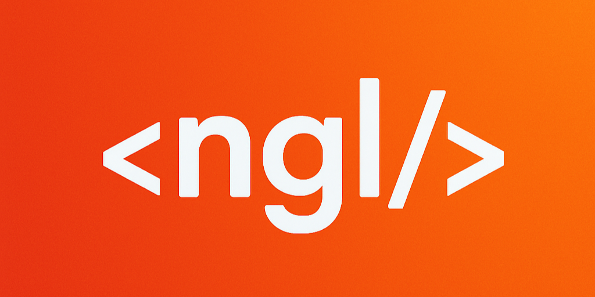

# NGL Job Tracker

A mobile application built with Flutter that simplifies tracking job applications. It registers as a share target on Android and iOS, allowing users to share job links directly from any app. The app presents a simple form to categorize and save the job, which is then automatically added to a Google Sheet.


## Features

- **Share to App**: Seamlessly share job links from browsers or other apps directly to the NGL Job Tracker.
- **Pre-filled Form**: The shared link is automatically populated in the form.
- **Simple Categorization**: Quickly add the company name and select the job type (New Grad or Intern).
- **Google Sheets Integration**: Submits all job application details directly to a designated Google Sheet.
- **Firebase Integration**: Dynamically fetches referrer and recruiter information from a Firebase Realtime Database.
- **Cross-Platform**: Works on both Android and iOS.

## Installation

To get this project up and running on your local machine, follow these steps.

1.  **Prerequisites**:
    - Ensure you have [Flutter](https://docs.flutter.dev/get-started/install) installed on your system.
    - You will need a Google Cloud Platform project with the Google Sheets API enabled.
    - You will also need a Firebase project with a Realtime Database.

2.  **Clone the Repository**:
    ```sh
    git clone https://github.com/your-username/ngl_job_app.git
    cd ngl_job_app/ngl_job_app_flutter
    ```

3.  **Set Up Credentials**:
    - In the Google Cloud Console, create a **Service Account** and download its JSON key.
    - **Important**: For security, this key should not be checked into source control.
    - Place the downloaded key in `ngl_job_app_flutter/assets/` and rename it to `secrets.json`.
    - The `.gitignore` file is already configured to ignore this file.

4.  **Install Dependencies**:
    ```sh
    flutter pub get
    ```

## How to Run

### Android

1.  Connect an Android device or start an Android emulator.
2.  Run the app from your terminal:
    ```sh
    flutter run
    ```
3.  To build a shareable APK:
    ```sh
    flutter build apk --release
    ```
    The output file will be located at `build/app/outputs/flutter-apk/app-release.apk`.

### iOS

1.  You must be on a macOS machine with Xcode installed.
2.  Open the iOS module in Xcode:
    ```sh
    open ios/Runner.xcworkspace
    ```
3.  Within Xcode, you must configure code signing with your Apple Developer account in the "Signing & Capabilities" tab.
4.  Connect an iOS device or start an iOS simulator.
5.  Run the app from your terminal:
    ```sh
    flutter run
    ```

## Technical Hurdles Solved

This project involved several interesting technical challenges:

- [x]  **Secure Credential Handling**: The app initially had Google Cloud credentials hardcoded, triggering a security warning from GCP. We refactored the app to load the service account key from a local `assets/secrets.json` file. This file is included in `.gitignore` to prevent the accidental exposure of sensitive credentials in the version history, adhering to security best practices.

- [x]  **Android Share Target Integration**: To allow the app to receive links from other apps, we configured Android's intent filters in `AndroidManifest.xml`. A `MethodChannel` was implemented to bridge the native Android environment with the Flutter UI, allowing the shared URL to be passed from the incoming `Intent` directly to the form in the Flutter app.

- [x]  **iOS Deep Linking for Sharing**: For iOS, a Share Extension is required for a similar "share-to-app" experience. We prepared the Flutter application to handle this by implementing deep linking using the `app_links` package. The app is configured to listen for a custom URL scheme (`ngljobtracker://`), which is the mechanism the future Share Extension will use to pass data to the main Flutter app.

- [x]  **Automated App Icon Generation**: To streamline asset management, we used the `flutter_launcher_icons` package. This allowed us to generate all the necessary app icon sizes for both Android and iOS from a single high-resolution source image, ensuring a consistent look across all platforms.

## Contributing

Open source contributions are welcome, especially from **iOS developers**!

If you have experience with Flutter and building iOS Share Extensions, your help would be greatly appreciated to complete the iOS sharing functionality. Please feel free to fork the repository, make your changes, and submit a pull request.

## License

This project is licensed under the MIT License. See the [LICENSE](LICENSE) file for details.
